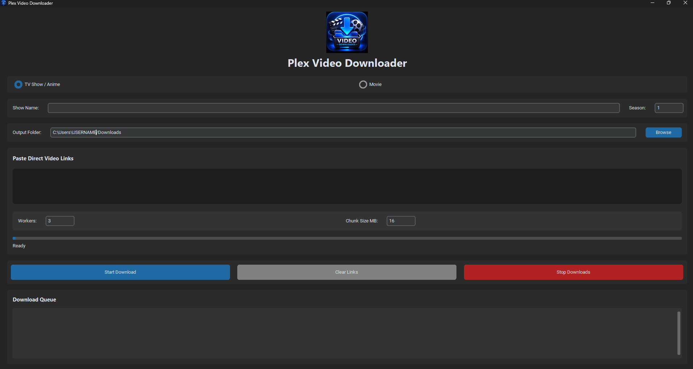

# Plex Video Downloader

Python desktop application built with CustomTkinter for downloading and organizing media files for Plex libraries.

## Download

Download the latest Windows executable from the Releases page:

https://github.com/zeroban/plex-video-downloader/releases/latest

## Screenshot



## Features

* TV Show / Anime downloads
* Movie downloads
* Multi-threaded downloading
* Adjustable worker count
* Adjustable chunk size
* Download queue tracking
* Stop active downloads
* Custom output folder support
* Plex-friendly media organization
* Modern dark-themed interface
* Download progress tracking

## Requirements

* Python 3.12+
* pip

## Installation

Clone the repository:

```bash
git clone https://github.com/zeroban/plex-video-downloader.git
cd plex-video-downloader
```

Install dependencies:

```bash
pip install -r requirements.txt
```

## Running the Application

```bash
python main.py
```

## Building the Executable

Install PyInstaller:

```bash
pip install pyinstaller
```

Build the executable:

```bash
pyinstaller --onefile --windowed --icon=downloadicon.ico main.py
```

The executable will be created in the `dist` folder.

## Application Overview

### TV Show / Anime Downloads

* Enter a show name
* Select the season number
* Paste episode URLs
* Download and organize episodes into Plex-friendly folders

### Movie Downloads

* Download movie files directly
* Organize content for Plex movie libraries
* Save files to a custom output location

### Download Controls

* Configure concurrent download workers
* Adjust download chunk size
* Track download progress
* Stop active downloads at any time

## Technologies Used

* Python
* CustomTkinter
* Requests
* Pillow (PIL)
* ThreadPoolExecutor
* PyInstaller

## Releases

Download pre-built Windows executables from:

https://github.com/zeroban/plex-video-downloader/releases

## Version

Current Release: **v1.0.0**

## License

This project is licensed under the MIT License.
